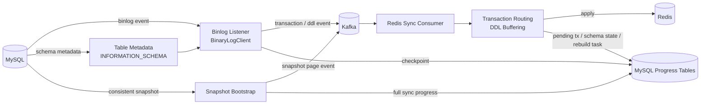
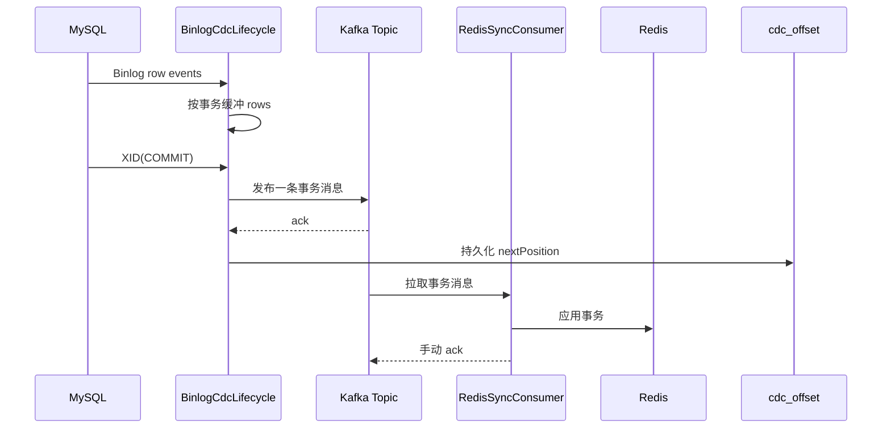
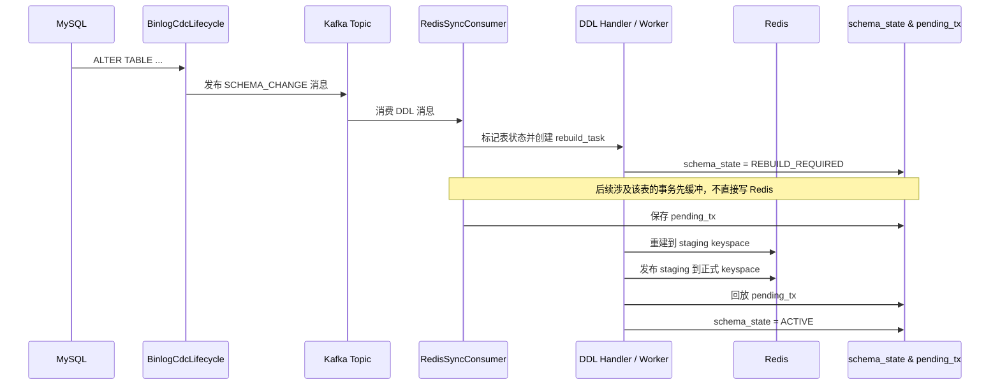

# Mini CDC Sync

一个面向业务数据同步场景的轻量级 CDC 项目：监听 MySQL Binlog，将事务级变更投递到 Kafka，再由下游消费者同步写入 Redis。

这个项目的目标不是复刻 Canal/Debezium，而是用一个可读、可扩展、适合二次开发的实现，把 `Binlog -> 消息队列 -> 下游缓存/索引` 这条链路真正跑通，并把一致性与工程边界讲清楚。

## 项目入口

- 想先跑起来：看 [5 分钟快速开始](#5-分钟快速开始)
- 想先看设计：看 [系统架构](#系统架构) 和 [核心一致性语义](#核心一致性语义)

## 项目背景

在很多业务系统里，MySQL 中的主数据需要同步到 Redis、Elasticsearch 或其他下游系统。传统做法往往是在业务代码里手写“数据库更新 + MQ”或者额外维护一套同步逻辑，问题通常有三个：

- 业务代码侵入性强，同步逻辑和业务逻辑耦合
- 多个项目重复实现同样的数据分发能力
- 失败恢复、位点推进、幂等处理容易分散在多个地方，长期维护成本高

`Mini CDC Sync` 的思路是把这条链路独立出来：

- 上游监听 MySQL Binlog
- 按事务聚合 CDC 事件
- 统一发布到 Kafka
- 下游消费者以可控方式写入 Redis
- 在需要时支持全量快照切换到增量同步
- 在部分破坏性 DDL 发生后，阻塞受影响事务并异步重建下游表数据

## 当前能力

当前版本已经覆盖以下能力：

- 支持监听多张 MySQL 表
- 支持按事务聚合 Binlog 事件并发布 Kafka 消息
- 支持 `INSERT`、`UPDATE`、`DELETE`
- 支持启动时 `LATEST` 或 `SNAPSHOT_THEN_INCREMENTAL`
- 支持 connector 级 checkpoint 持久化与重启恢复
- 支持分页全量快照，并记录 `full_sync_task` 进度
- 支持 Redis 下游消费失败重试与最终停机保护
- 支持两种 Redis 落地模式：
  - `simple`：简单幂等写入
  - `meta`：带版本元数据的覆盖保护
- 支持识别部分 DDL，并在需要时触发表级异步重建
- 支持重建期间缓冲受影响事务，并在重建后回放

## 5 分钟快速开始

### 1. 环境要求

- JDK 17
- Maven 3.9+
- Docker + Docker Compose
- MySQL 8.0+

### 2. 启动 Kafka 和 Redis

仓库当前没有内置 `docker-compose.yml`，推荐在项目根目录创建一个最小运行示例：

```yaml
services:
  zookeeper:
    image: confluentinc/cp-zookeeper:7.5.0
    container_name: mini-cdc-zookeeper
    environment:
      ZOOKEEPER_CLIENT_PORT: 2181
      ZOOKEEPER_TICK_TIME: 2000
    ports:
      - "2181:2181"

  kafka:
    image: confluentinc/cp-kafka:7.5.0
    container_name: mini-cdc-kafka
    depends_on:
      - zookeeper
    ports:
      - "9092:9092"
    environment:
      KAFKA_BROKER_ID: 1
      KAFKA_ZOOKEEPER_CONNECT: zookeeper:2181
      KAFKA_LISTENERS: PLAINTEXT://0.0.0.0:9092
      KAFKA_ADVERTISED_LISTENERS: PLAINTEXT://localhost:9092
      KAFKA_OFFSETS_TOPIC_REPLICATION_FACTOR: 1
      KAFKA_TRANSACTION_STATE_LOG_REPLICATION_FACTOR: 1
      KAFKA_TRANSACTION_STATE_LOG_MIN_ISR: 1

  redis:
    image: redis:7.2
    container_name: mini-cdc-redis
    command: ["redis-server", "--appendonly", "yes", "--requirepass", "123456"]
    ports:
      - "6379:6379"
```

启动：

```bash
docker compose up -d
```

### 3. 准备 MySQL

请确保 MySQL 开启了 Binlog，并满足以下最低要求：

```ini
[mysqld]
server-id=1
log-bin=mysql-bin
binlog_format=ROW
binlog_row_image=FULL
```

创建演示库与业务表：

```sql
CREATE DATABASE IF NOT EXISTS mini DEFAULT CHARACTER SET utf8mb4;
USE mini;

SOURCE src/main/sql/user.sql;
SOURCE src/main/sql/order.sql;
```

创建 CDC 内部进度表：

```sql
USE mini;

SOURCE src/main/sql/offset.sql;
SOURCE src/main/sql/full-updat.sql;
SOURCE src/main/sql/schema-state.sql;
SOURCE src/main/sql/rebuild-task.sql;
SOURCE src/main/sql/pending-tx.sql;
```

### 4. 配置环境变量

项目默认值已经能满足本地演示，但推荐显式指定：

```bash
export CDC_MYSQL_HOST=127.0.0.1
export CDC_MYSQL_PORT=3306
export CDC_MYSQL_USERNAME=root
export CDC_MYSQL_PASSWORD=1234
export CDC_MYSQL_JDBC_URL='jdbc:mysql://127.0.0.1:3306/mini?useUnicode=true&characterEncoding=UTF-8&serverTimezone=Asia/Shanghai&useSSL=false&allowPublicKeyRetrieval=true'
export KAFKA_BOOTSTRAP_SERVERS=127.0.0.1:9092
export REDIS_HOST=127.0.0.1
export REDIS_PORT=6379
export REDIS_PASSWORD=123456
export CDC_CONNECTOR_NAME=mini-user-sync
```

Windows PowerShell 示例：

```powershell
$env:CDC_MYSQL_HOST='127.0.0.1'
$env:CDC_MYSQL_PORT='3306'
$env:CDC_MYSQL_USERNAME='root'
$env:CDC_MYSQL_PASSWORD='1234'
$env:CDC_MYSQL_JDBC_URL='jdbc:mysql://127.0.0.1:3306/mini?useUnicode=true&characterEncoding=UTF-8&serverTimezone=Asia/Shanghai&useSSL=false&allowPublicKeyRetrieval=true'
$env:KAFKA_BOOTSTRAP_SERVERS='127.0.0.1:9092'
$env:REDIS_HOST='127.0.0.1'
$env:REDIS_PORT='6379'
$env:REDIS_PASSWORD='123456'
$env:CDC_CONNECTOR_NAME='mini-user-sync'
```

### 5. 启动项目

```bash
mvn spring-boot:run
```

项目默认端口：

- 应用端口：`8089`
- Kafka Topic：`user-change-topic`
- Redis 写入模式：`meta`
- 启动策略：`SNAPSHOT_THEN_INCREMENTAL`

### 6. 验证链路

向 MySQL 写入一笔跨表事务：

```sql
USE mini;

BEGIN;
INSERT INTO user(username, nickname, email, status, created_at, updated_at)
VALUES ('alice', 'Alice', 'alice@test.com', 1, NOW(), NOW());

INSERT INTO `order`(user_id, amount, created_at, updated_at)
VALUES (1, 99.90, NOW(), NOW());
COMMIT;
```

验证 Redis：

```bash
redis-cli -a 123456 GET cdc:mini.user:1
redis-cli -a 123456 GET cdc:mini.order:1
```

如果使用 `meta` 模式，还可以查看版本元数据：

```bash
redis-cli -a 123456 GET mini-cdc:row:meta:mini.user:1
redis-cli -a 123456 GET mini-cdc:row:meta:mini.order:1
```

## 系统架构



### 核心模块

- `cdc`
  - 监听 Binlog，按事务缓冲事件，在 `XID` 提交时发布 Kafka 消息
- `checkpoint`
  - 保存 connector 级位点和全量快照进度
- `snapshot`
  - 在增量消费前执行一致性快照，并分页发布 `SNAPSHOT_UPSERT`
- `redis`
  - 负责下游写入 Redis，支持 `simple` / `meta` 两种策略
- `ddl`
  - 识别部分 DDL，维护 schema 状态、重建任务、事务缓冲与回放
- `metadata`
  - 从 `INFORMATION_SCHEMA` 读取列和主键信息

## 时序图

### 正常增量链路



### 破坏性 DDL 下的重建链路



## 核心一致性语义

### 1. 上游语义：事务级发布

项目不是按单条 row 直接下发 Kafka，而是把同一个 MySQL 事务中的多条变更先缓冲起来，在收到 `XID` 后一次性发布一条事务消息。

这意味着：

- 同一个事务中的多表变更会被聚合到一条消息中
- 下游可以基于事务消息做更稳定的幂等和排序判断
- 非监听表不会出现在业务消息体里，但外部事务仍可推进 checkpoint

### 2. Checkpoint 语义：Kafka 成功后再推进

checkpoint 记录的是“下次恢复从哪里继续读”，而不是一个模糊的“当前处理到了哪里”。

当前实现中：

- 只有 Kafka 发送成功后才会持久化 checkpoint
- 如果 Kafka 成功、checkpoint 持久化前宕机，重启后可能重复发送
- 但不会因为过早推进 checkpoint 而丢失数据

因此，上游恢复语义是：

- `at-least-once`
- 允许重复
- 不允许静默丢失

### 3. 下游语义：事务幂等 + 行级版本保护

Redis 下游提供两层保护：

- 事务级幂等：
  - 每条事务消息都会写入 `transaction-done` 标记
  - 已处理过的事务不会被重复应用
- 行级版本保护：
  - `meta` 模式下，每个业务 key 旁边会维护一份行版本元数据
  - 当旧事件、重复事件或重建阶段的晚到事件出现时，只允许更“新”的版本覆盖

这使得当前版本即使在“允许重复”的上游语义下，仍然可以尽量避免 Redis 被旧数据回写覆盖。

### 4. Snapshot Cutover 语义

当启动策略为 `SNAPSHOT_THEN_INCREMENTAL` 时：

- 先记录当前 MySQL 最新 Binlog 位点
- 再基于一致性快照分页读取业务表
- 将快照页以 `SNAPSHOT_UPSERT` 事件发布到 Kafka
- 快照完成后，从之前记录的位点进入增量监听

这保证了：

- 快照与增量之间有明确 cutover 点
- 启动时不会因为“先扫全量再接增量”而丢掉 cutover 后的新变更

### 5. DDL 期间的语义

对于部分破坏性 DDL，如删列、改列名、改列定义：

- 下游不会立刻把后续事务直接写入 Redis
- 涉及受影响表的事务会先进入 `pending_tx`
- 重建任务会先把当前表数据重建到 staging keyspace
- staging 发布完成后，再回放 pending 事务

这样做的目标不是全局停机，而是：

- 只阻塞受影响表
- 不阻塞其他表的正常同步
- 降低 DDL 期间下游结构错配带来的脏数据风险

## 关键数据模型

### Kafka 消息

事务消息采用统一 envelope：

```json
{
  "messageType": "TRANSACTION",
  "transaction": {
    "transactionId": "mini-user-sync:mysql-bin.000001:345:240",
    "connectorName": "mini-user-sync",
    "binlogFilename": "mysql-bin.000001",
    "xid": 345,
    "nextPosition": 240,
    "timestamp": 1710000000000,
    "events": [
      {
        "database": "mini",
        "table": "user",
        "eventIndex": 0,
        "eventType": "INSERT",
        "primaryKey": { "id": 1 },
        "before": null,
        "after": {
          "id": 1,
          "username": "alice"
        }
      }
    ]
  }
}
```

### Redis Key 设计

默认配置：

- 业务数据：`cdc:{database}.{table}:{pk}`
- 事务去重：`mini-cdc:txn:done:{transactionId}`
- 行元数据：`mini-cdc:row:meta:{database}.{table}:{pk}`

例如：

- `cdc:mini.user:1`
- `cdc:mini.order:1`
- `mini-cdc:row:meta:mini.user:1`

## 配置说明

核心配置位于 [src/main/resources/application.yml](src/main/resources/application.yml)。

重点配置项：

- `mini-cdc.mysql.tables`
  - 要监听的 MySQL 表列表
- `mini-cdc.kafka.topic`
  - CDC 统一投递 Topic
- `mini-cdc.checkpoint.startup-strategy`
  - 启动策略：`LATEST` / `SNAPSHOT_THEN_INCREMENTAL`
- `mini-cdc.snapshot.page-size`
  - 快照分页大小
- `mini-cdc.redis.apply-mode`
  - Redis 落地模式：`simple` / `meta`
- `mini-cdc.ddl.*`
  - DDL staging、轮询间隔、最大重试次数、运行超时

## 目录结构

```text
src/main/java/com/yunye/mncdc
├─ cdc          # Binlog 监听与 Kafka 发布
├─ checkpoint   # checkpoint 与全量任务状态
├─ config       # Spring / Kafka / 属性配置
├─ ddl          # schema 状态、缓冲事务、重建与回放
├─ entity       # MyBatis Plus 实体
├─ mapper       # MyBatis Mapper
├─ metadata     # 表元数据加载
├─ model        # 核心消息模型与领域对象
├─ redis        # Redis 下游应用策略
├─ shutdown     # 失败时的停机处理
└─ snapshot     # 全量快照读取与分页构造
```

## 已知限制

当前版本仍然是一个偏“轻量工程化实现”的项目，以下限制是明确存在的：

- 仅支持 MySQL 作为上游数据源
- 仅内置 Redis 作为下游落地目标
- 统一使用单个 Kafka Topic，暂未做更细粒度路由
- 默认是单实例、单消费者并发场景
- DDL 分类目前只覆盖部分 `ALTER TABLE` 场景
- 对破坏性 DDL 的处理是“表级重建”，不是通用 schema migration 引擎
- Binlog 被 MySQL purge 后，当前版本不提供自动补偿恢复
- 仓库当前未内置 `docker-compose.yml`、管理后台和可视化运维界面
- 启动依赖手动创建内部进度表

## 适用场景

适合：

- 学习 CDC 链路的核心实现
- 演示 `MySQL -> Kafka -> Redis` 数据同步
- 做轻量级业务缓存同步实验
- 作为后续扩展到 Elasticsearch / 多下游 / 插件化的起点

不适合直接用于：

- 高可用生产集群
- 海量表自动发现
- 复杂 DDL 高频变更场景
- 需要严格 `exactly-once` 端到端语义的系统

## 测试与验证

项目包含覆盖以下方向的测试：

- CDC 事务聚合与多表监听
- checkpoint 持久化
- snapshot 分页与启动切换
- Redis 落地策略
- DDL 重建与事务回放
- Kafka 消费失败处理

如果你希望在本地验证完整链路，推荐按下面顺序进行：

1. 启动 Kafka、Redis、MySQL
2. 初始化业务表和内部进度表
3. 启动应用
4. 先观察快照数据是否写入 Redis
5. 再执行一笔事务，观察 Kafka 日志与 Redis 结果
6. 尝试执行一次破坏性 DDL，再观察重建和回放行为

## 后续演进方向

- 提供仓库内置 `docker-compose.yml`
- 增加端到端集成测试与演示脚本
- 增加 Actuator / 健康检查 / checkpoint 查询接口
- 支持更多 DDL 类型
- 支持更多下游目标，如 Elasticsearch
- 抽象为更通用的 CDC 组件或 Starter

